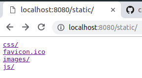
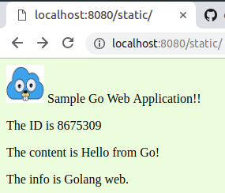
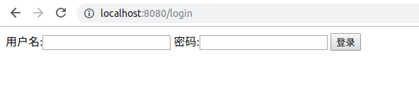
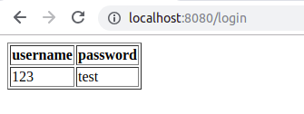
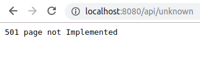

# CLoudGo-io

设计一个 web 小应用，展示静态文件服务、js 请求支持、模板输出、表单处理、Filter 中间件设计等方面的能力。（不需要数据库支持）

# 任务要求
1. 支持静态文件服务
2. 支持简单 js 访问
3. 提交表单，并输出一个表格
4. 对 /unknown 给出开发中的提示，返回码 5xx

# 静态文件服务
把path以"/static/"前缀的URL定位到`webRoot + "/assets/`为虚拟根目录的文件系统

在assets文件夹中不添加index.html，访问http://localhost:8080/static/
,可以看到静态文件目录:

# 简单js访问
在assets中添加index.html，并增加对/api/test的处理，可以看到经js处理过后的页面

# 提交表单和输出表格
提交表单我采用了模板输出，用到了最简单直接的`github.com/unrolled/render`
访问http://localhost:8080/login
,可以看到登陆界面的表单:

输入用户名和密码后点击登陆，输出表格:

# 对unknown的开发提示
我仿照NotFound函数实现，写了501 Not Implemented 函数 NotImplemented 和 NotImplementedHandler

通过NotImplementedHandler来实现访问/api/unknown时页面提示501 Not Implemented

